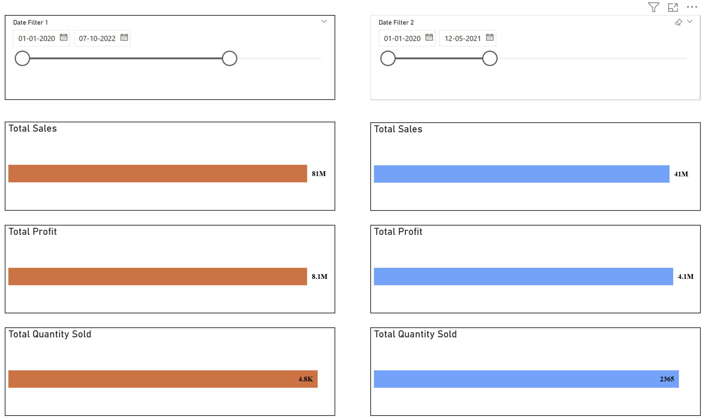

# 📊 Power BI Sales Data Analysis Dashboard

This Power BI project presents a comprehensive **Sales Data Analysis** using real-world business metrics. The dashboard was developed using a fictional retail dataset as part of a guided course by Krish Naik.

---

## 📁 Project Overview

The goal of this dashboard is to analyze sales, profit, discounts, and customer behavior to uncover patterns and business insights. The data model was built in Power BI using Excel as a source and enhanced with DAX and Power Query.

---

## 🛠️ Tools & Techniques Used

- Power BI Desktop  
- Power Query Editor (for data cleaning and shaping)  
- DAX (for KPIs, calculated columns, and measures)  
- Slicers and filters for interactive exploration  
- **Visuals Used**: Stacked bar charts, column charts, line charts, map, and KPI cards

---

## 📊 Key Features & KPIs

1. Top/Bottom 5 products by Sales, Profit, and Quantity Sold  
2. Sales trends analysis over daily, monthly, quarterly, and yearly intervals  
3. Relationship between Sales and Profit visualized  
4. Sales/Profit/Quantity comparison across two selected time periods  
5. Average Discount offered by Discount Category  
6. Total number of orders  
7. Dynamic filtering on order-level metrics like Sales, Profit, Discount, Net Sales using Product, Date, Customer ID, Promotion Category  
8. City-wise Sales Breakdown

---

## 📂 Files Included

- `power_bi_project_1.pbix` – Power BI Dashboard File  
- `Store+Data.xlsx` – Source Dataset used for the report

---

## 🎯 What I Learned

- Building professional dashboards using real-world KPIs  
- Connecting and transforming data using Power Query Editor  
- Writing efficient DAX for business metrics  
- Making data-driven decisions with interactive reports  

---

## 📌 Credits

Inspired by Krish Naik’s Power BI course. Dataset used is fictional and for educational purposes only.

---

## 📸 Dashboard Preview

### 🔹 Page 1 – Executive Summary Overview

### 🔹 Page 2 – Top/Bottom 5 Product Analysis

### 🔹 Page 3 – Comparison of Sales, Profit & Quantity

### 🔹 Page 4 – Dynamic Filtering & Edit Interactions

### 🔹 Page 5 – Order Table with Visual Filtering

---

Updated README with full project details
